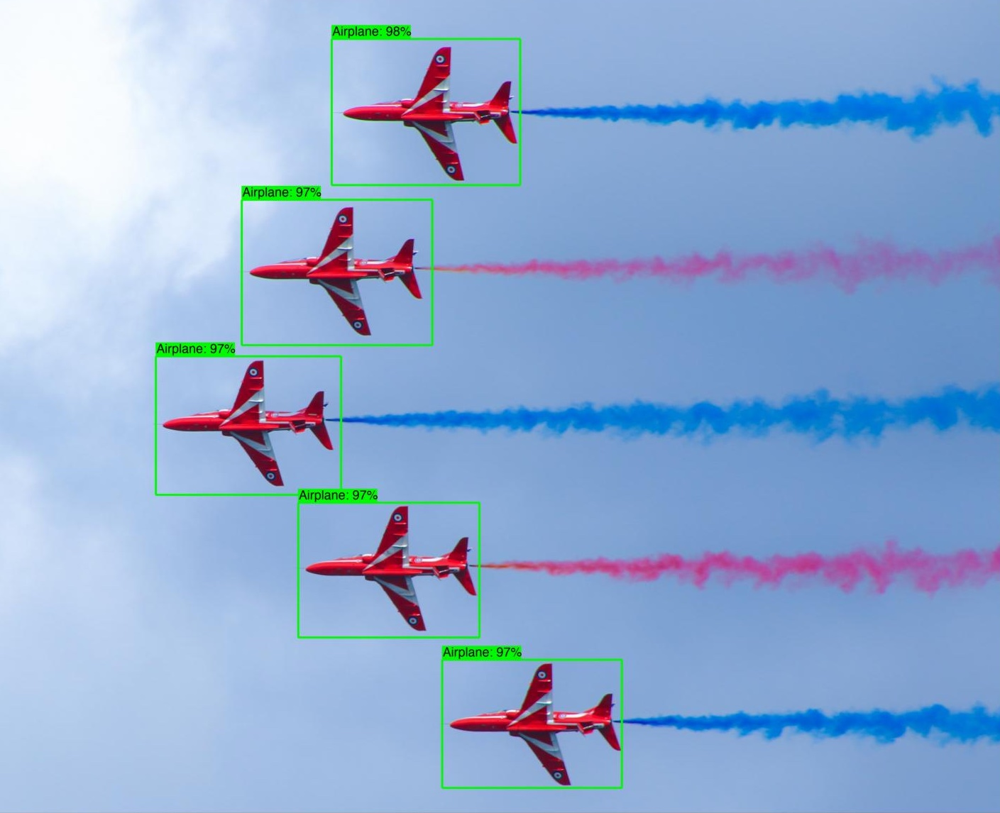
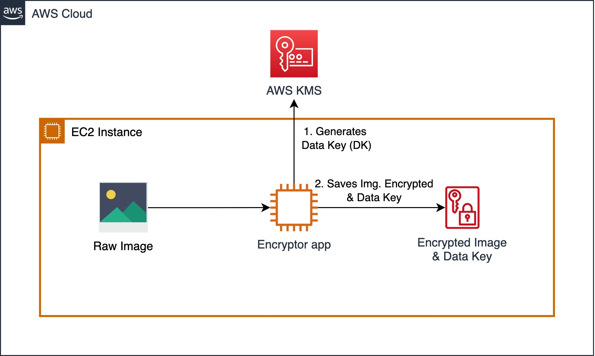
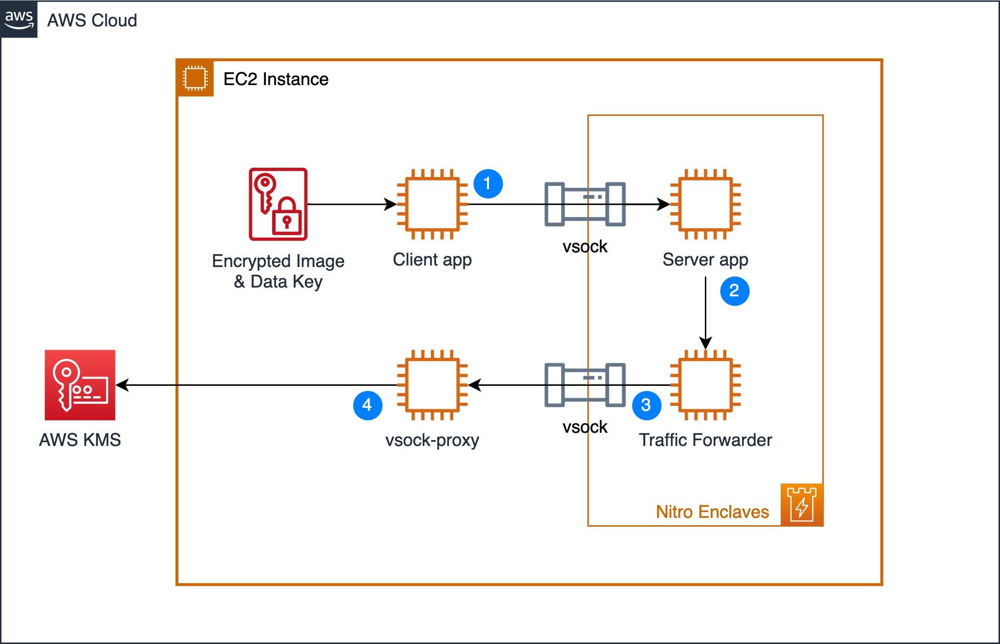
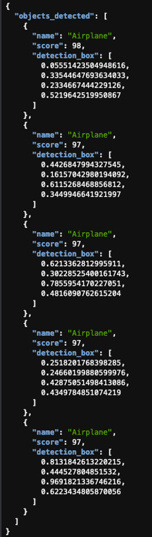

## Nitro Enclaves - Object Detection
This project demonstrates how to deploy an AI/ML workload which runs inferencing within Nitro Enclaves to securely process sensitive data. The image below is used to demonstrate the process of how data can be encrypted, transferred through a [vsock](https://docs.aws.amazon.com/enclaves/latest/user/nitro-enclave-concepts.html#term-socket) to an enclave, decrypted and processed. The workload uses an open-source AI/ML model to detect objects in the image, which represents the sensitive data, and returns a summary of the type of objects detected. 



For more information on Nitro and Nitro Enclaves, check out [AWS Nitro System](https://aws.amazon.com/ec2/nitro/) and [Nitro Enclaves](https://aws.amazon.com/ec2/nitro/nitro-enclaves/). 

## Overview

As a first step, we are going to encrypt an image of airplanes using a Python script (Encryptor app - see Figure below) which we are going to run on an EC2 instance. In a real-world scenario this step would be performed in a secure environment like a Nitro Enclave or a secured workstation before transferring the encrypted data. The Encryptor app uses AWS KMS [envelope encryption](https://docs.aws.amazon.com/wellarchitected/latest/financial-services-industry-lens/use-envelope-encryption-with-customer-master-keys.html) with a symmetrical Customer Master Key (CMK) to encrypt the data.



Now that the image is encrypted, let's look at each component and its role in the solution architecture, see Figure 3 below for reference.

1)	The Client app reads the encrypted image file and sends it to the Server app over the vsock (secure local communication channel).
2)	The Server app, running inside a Nitro Enclave, extracts the encrypted data key and sends it to AWS KMS for decryption. Once the data key is decrypted, the Server app uses it to decrypt the image and run inference on it to detect the objects in the image. Once the inference is complete, the results are returned to the Client app without exposing the original image or sensitive data. 
3)	To allow the Nitro Enclave to communicate with AWS KMS, we use the [KMS Enclave Tool](https://github.com/aws/aws-nitro-enclaves-sdk-c/blob/main/docs/kmstool.md#kmstool-enclave-cli) which uses the vsock to connect to AWS KMS and decrypt the encrypted key.
4)	The vsock-proxy (packaged with the Nitro CLI) routes incoming traffic from the KMS Tool to AWS KMS provided that the AWS KMS endpoint is included on the vsock-proxy allowlist. The response from AWS KMS is then sent back to the KMS Enclave Tool over the vsock.




As part of the request to AWS KMS, the KMS Enclave Tool extracts and sends a signed attestation document to AWS KMS containing the [enclave’s measurements](https://docs.aws.amazon.com/enclaves/latest/user/set-up-attestation.html#where) to prove its identity. AWS KMS will validate the attestation document before decrypting the data key. Once validated, the data key is decrypted and securely returned to the KMS Tool which securely transfers it to the Server app to decrypt the image.


## Environment Setup
### AWS Cloudformation Template
We are going to use AWS CloudFormation to provision our infrastructure. 
1.	Download the CloudFormation (CFN) template nitro-enclave-demo.yaml. This template orchestrates an EC2 instance with the required networking components such as a [VPC](https://aws.amazon.com/vpc/), [Subnet](https://docs.aws.amazon.com/vpc/latest/userguide/VPC_Subnets.html) and [NAT Gateway](https://docs.aws.amazon.com/vpc/latest/userguide/vpc-nat-gateway.html).
2.	Log in to the AWS Management Console and select the AWS Region where you’d like to deploy this stack. In the example, we select Canada (Central).
3.	Open the AWS CloudFormation console at: https://console.aws.amazon.com/cloudformation/
4.	Choose Create Stack, Template is ready, Upload a template file. Choose File to select nitro-enclave-demo.yaml that you saved locally.
5.	Choose Next, enter a stack name such as NitroEnclaveStack, choose Next.
6.	On the subsequent screens, leave the defaults, and continue to select Next until you arrive at the Review step 
7.	At the Review step, scroll to the bottom and place a checkmark in “I acknowledge that AWS CloudFormation might create IAM resources with custom names.” and click “Create stack”
8.	The stack status is initially CREATE_IN_PROGRESS. It will take around 5 minutes to complete. Click the Refresh button periodically to refresh the status. Upon completion, the status changes to CREATE_COMPLETE.
9.	Once completed, click on “Resources” tab and search for “NitroEnclaveInstance”, click on its “Physical ID” to navigate to the EC2 instance
10.	On the Amazon EC2 page, select the instance and click “Connect” 
11.	Choose “Session Manager” and click “Connect”

Note, the IAM role that's associated with your VPC Flow Log must have sufficient permissions to publish flow logs to the specified log group in CloudWatch Logs. The example used is a simple one for demonstration, you should carefully review your IAM roles to ensure the appropriate trust policy is defined along with the proper conditions so that only the VPC Flow Log service can assume the role and execute the defined actions under specific conditions, also known as [least-privilege permissions](https://docs.aws.amazon.com/IAM/latest/UserGuide/best-practices.html#grant-least-privilege). 

### EC2 Instance Configuration
Now that the EC2 instance has been provisioned and you are connected to it, follow these steps to configure it:
1.	Install the Nitro Enclaves CLI which will allow you to build and run a Nitro Enclave application:
```bash
sudo amazon-linux-extras install aws-nitro-enclaves-cli -y
sudo yum install aws-nitro-enclaves-cli-devel -y
```
2.	Verify that the Nitro Enclaves CLI was installed successfully by running the following command:
```bash
nitro-cli --version
```
3. You should have by now the Nitro CLI installed and the expected output will be `Nitro CLI 1.3.1`

4.	To download the application from GitHub and build a docker image, you need to first install Docker and Git by executing the following commands:
 ```bash
sudo yum install git -y
sudo usermod -aG ne ssm-user
sudo usermod -aG docker ssm-user
sudo systemctl start docker && sudo systemctl enable docker
```

### Nitro Enclave Configuration
A Nitro Enclave is an isolated environment which runs within the EC2 instance, hence we need to specify the resources (CPU & Memory) that the Nitro Enclaves allocator service dedicates to the enclave.
1.	Enter the following commands to set the CPU and Memory available for the Nitro Enclave allocator service to allocate to your enclave container:
```bash
ALLOCATOR_YAML=/etc/nitro_enclaves/allocator.yaml
MEM_KEY=memory_mib
DEFAULT_MEM=20480
sudo sed -r "s/^(\s*${MEM_KEY}\s*:\s*).*/\1${DEFAULT_MEM}/" -i "${ALLOCATOR_YAML}"
sudo systemctl start nitro-enclaves-allocator.service && sudo systemctl enable nitro-enclaves-allocator.service
```
2.	To verify the configuration has been applied, run the following command and note the values for memory_mib and cpu_count:
```bash
cat /etc/nitro_enclaves/allocator.yaml
```

## Creating a Nitro Enclave Image
### Download the Project and Build the Enclave Base Image
Now that the EC2 instance is configured, download the workload code and build the enclave base Docker image. This image contains the Nitro Enclaves Software Development Kit (SDK) which allows an enclave to request a cryptographically signed attestation document from the Nitro Hypervisor. The attestation document includes unique measurements (SHA384 hashes) that are used to prove the enclave’s identity to services such as AWS KMS.
1.	Clone the Github Project
```bash
cd ~/ && git clone https://github.com/aws-samples/aws-nitro-enclaves-ai-ml-object-detection.git
```
2.	Navigate to the cloned project’s folder and build the "enclave_base" image:
```bash
cd ~/aws-nitro-enclaves-ai-ml-object-detection/enclave-base-image
sudo docker build ./ -t enclave_base
```
Note: The above step will take approximately 8-10 minutes to complete.

### Build and Run The Nitro Enclave Image
To build the Nitro Enclave image of the workload, build a docker image of your application and then use the Nitro CLI to build the Nitro Enclave image:
1.	Download TensorFlow pre-trained model:
```bash
cd ~/aws-nitro-enclaves-ai-ml-object-detection/src
mkdir -p models/faster_rcnn_openimages_v4_inception_resnet_v2_1 && cd models/
wget -O tensorflow-model.tar.gz https://tfhub.dev/google/faster_rcnn/openimages_v4/inception_resnet_v2/1?tf-hub-format=compressed
tar -xvf tensorflow-model.tar.gz -C faster_rcnn_openimages_v4_inception_resnet_v2_1
``` 
2.	Navigate to the use-case folder and build the docker image for the application:
```bash
cd ~/aws-nitro-enclaves-ai-ml-object-detection/src
sudo docker build ./ -t nitro-enclave-container-ai-ml:latest
```
3.	Use the Nitro CLI to build an Enclave Image File (.eif) using the docker image you built in the previous step:
```bash
sudo nitro-cli build-enclave --docker-uri nitro-enclave-container-ai-ml:latest --output-file nitro-enclave-container-ai-ml.eif
```
4.	The output of the previous step produces the Platform configuration registers or PCR hashes and a nitro enclave image file (.eif). Take note of the PCR0 value, which is a hash of the enclave image file. 
Example PCR0:
```
{
    "Measurements": {
        "PCR0": "7968aee86dc343ace7d35fa1a504f955ee4e53f0d7ad23310e7df535a187364a0e6218b135a8c2f8fe205d39d9321923"
        ...
    }
}
```
5.	Launch the Nitro Enclave container using the Enclave Image File (.eif) generated in the previous step and allocate resources to it. You should allocate at least 4 times the EIF file size for enclave memory. This is necessary because the tmpfs filesystem uses half of the memory and the remainder of the memory is used to uncompress the initial initramfs where the application executable resides. For CPU allocation, you should allocate CPU in full cores i.e. 2x vCPU for x86 hyper-threaded instances. 
In our case, we are going to allocate 20GB or 20,480 MB for the enclave and 2vCPU:
```bash
sudo nitro-cli run-enclave --cpu-count 2 --memory 20480 --eif-path nitro-enclave-container-ai-ml.eif
```
Note: Allow a few seconds for the server to boot up prior to running the Client app in the below section “Object Detection using Nitro Enclaves”. 
### Update the KMS Key Policy to Include the PCR0 Hash
Now that you have the PCR0 value for your enclave image, update the KMS key policy to only allow your Nitro Enclave container access to the KMS key.
1.	Navigate to AWS KMS in your AWS Console and make sure you are in the same region where your CloudFormation template was deployed
2.	Select “Customer managed keys”
3.	Search for a key with alias “EnclaveKMSKey” and click on it
4.	Click “Edit” on the “Key Policy”
5.	Scroll to the bottom of the key policy and replace the value of "EXAMPLETOBEUPDATED" for the "kms:RecipientAttestation:PCR0" key with the PCR0 hash you noted in the previous section and click "Save changes"
## AI/ML Object Detection using a Nitro Enclave
Now that you have an enclave image file, run the components of the solution.

### Install Python 3.9 as a Pre-requisite
1. Run  the following commands:
```bash
sudo yum install gcc openssl-devel bzip2-devel libffi-devel -y
cd /opt 
sudo wget https://www.python.org/ftp/python/3.9.16/Python-3.9.16.tgz 
sudo tar xzf Python-3.9.16.tgz 
cd Python-3.9.16 
sudo ./configure --enable-optimizations 
sudo make altinstall 
```

### Requirements Installation for Client App
1.	Install the python requirements using the following command:
```bash
cd ~/aws-nitro-enclaves-ai-ml-object-detection/src
pip3.9 install -r requirements.txt
```
2.	Set the region that your CloudFormation stack is deployed in. In our case we selected Canada (Centra)
```bash
CFN_REGION=ca-central-1
```
3.	Run the following command to encrypt the image using the AWS KMS key “EnclaveKMSKey”, make sure to replace “ca-central-1” with the region where you deployed your CloudFormation template:
```bash
python3.9 ./envelope-encryption/encryptor.py --filePath ./images/air-show.jpg --cmkId alias/EnclaveKMSkey --region $CFN_REGION
```
4.	Verify that the output contains: file encrypted? True
Note: The previous command generates two files: an encrypted image file and an encrypted data key file. The data key file is generated so we can demonstrate an attempt from the parent instance at decrypting the data key. 

### Launching VSock Proxy
Launch the VSock Proxy which proxies requests from the Nitro Enclave to an external endpoint, in this case, to AWS KMS. Note the file vsock-proxy-config.yaml contains a list of endpoints which allow-lists the endpoints that an enclave can communicate with.
```bash
cd ~/aws-nitro-enclaves-ai-ml-object-detection/src
vsock-proxy 8001 "kms.$CFN_REGION.amazonaws.com" 443 --config vsock-proxy-config.yaml &
```
### Object Detection using Nitro Enclaves
Send the encrypted image to the enclave to decrypt the image and use the AI/ML model to detect objects and return a summary of the objects detected: 
```bash
cd ~/aws-nitro-enclaves-ai-ml-object-detection/src
python3.9 client.py --filePath ./images/air-show.jpg.encrypted | jq -C '.'
```
The previous step takes around a minute to complete when first called. Inside the enclave, the server application decrypts the image, runs it through the AI/ML model to generate a list of objects detected and returns that list to the client application.



### Attempt to Decrypt Data Key using Parent Instance Credentials
To prove that the parent instance is not able to decrypt the content, attempt to decrypt the image using the parent’s credentials:
```bash
cd ~/aws-nitro-enclaves-ai-ml-object-detection/src
aws kms decrypt --ciphertext-blob fileb://images/air-show.jpg.data_key.encrypted --region $CFN_REGION
```
**Note:** The command is expected to fail with AccessDeniedException, since the parent instance is not allowed to decrypt the data key.


## Cleanup
To delete the CloudFormation stack, you can follow the steps at this [link](https://docs.aws.amazon.com/AWSCloudFormation/latest/UserGuide/cfn-console-delete-stack.html).


## Security

See [CONTRIBUTING](CONTRIBUTING.md#security-issue-notifications) for more information.

## License

This library is licensed under the MIT-0 License. See the [LICENSE](LICENSE) file.

## Thanks
The image used in this demo was taken from [Pexels](https://www.pexels.com/photo/red-arrows-in-aerobatics-show-disbursing-red-and-blue-smoke-6691146/) and is under [Pexels Free to use - License](https://www.pexels.com/license/)