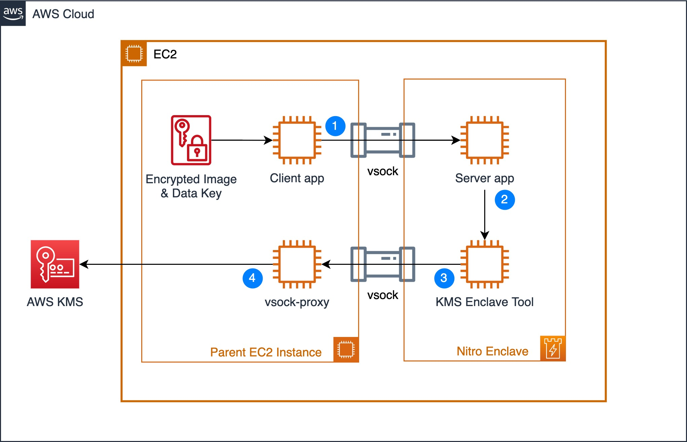

## Nitro Enclaves - Object Detection
This project showcases an advanced use-case on how to process confidential data using AWS Nitro Enclaves and AI-ML to detect and generate a list of objects in an image.  


## Intro on Nitro Enclaves
AWS Nitro Enclaves enables customers to create isolated compute environments to further protect and securely process highly sensitive data such as personally identifiable information (PII), healthcare, financial, and intellectual property data within their Amazon EC2 instances. Nitro Enclaves uses the same Nitro Hypervisor technology that provides CPU and memory isolation for EC2 instances.

Enclaves offers an isolated, hardened, and highly constrained environment to host security-critical applications. Nitro Enclaves includes cryptographic attestation for your software, so that you can be sure that only authorized code is running, as well as integration with the AWS Key Management Service (AWS KMS), so that only your enclave container can access sensitive key material.

For more information, check out [AWS Nitro System](https://aws.amazon.com/ec2/nitro/) and [Nitro Enclaves](https://aws.amazon.com/ec2/nitro/nitro-enclaves/). 

## Overview

In this blog, we are going to use an image of airplanes which we will encrypt using AWS KMS envelope encryption with a symmetrical customer master key (CMK), however you can also use asymmetrical keys to perform your encryption / decryption if you choose so.


Once the image is encrypted, the “Client app” will read the file and send it to the “Server app” over the secure local communication channel – vsock.


 
The server running inside a Nitro Enclave, retrieves the encrypted data key which is encrypted as part of the image file and need to send it to AWS KMS to in order to decrypt it and subsequently be able to decrypt the image before running inference on it. 

To allow the Nitro Enclave to communicate with external endpoints such as AWS KMS, we will need to run a proxy server on the host instance (vsock-proxy) and Traffic Forwarder in the Nitro Enclave. 

Hence traffic initiated by the server app, such as the request to AWS KMS to decrypt the data key has to go through the Traffic Forwarder (on port 443) and from there to the vsock-proxy. The vsock-proxy will then route traffic to AWS KMS. 

As part of the request to AWS KMS, the server app sends its unique cryptographically signed attestation document to AWS KMS to prove its identity. AWS KMS will validate the attestation document and if valid will decrypt the data key and return it to server app which can then use the data key to decrypt the airplanes image. 

Once the image is decrypted, the server app is able to run inference on the image using the pre-trained AI-ML model and detect the objects in the picture. 

Finally the server app will return a summary of the objects detected to the client app. 


## Environment Setup
### Cloudformation Template
1. Download the CFN template named [nitro-enclave-demo.yaml](https://gitlab.aws.dev/jdesau/natsecnitroenclavedemo/-/raw/main/nitro-enclave-demo.yaml?inline=false)
    - The CFN template orchestrates an EC2 instance with the required networking components such as a VPC, Subnet and NAT Gateway. 
2. Deploy this CFN template in your AWS account
3. Connect to the newly created EC2 instance via SSM

### EC2 Instance Setup and Configuration
1. Enter the following commands to enable and install required packages:
```
sudo amazon-linux-extras install aws-nitro-enclaves-cli -y
sudo yum install aws-nitro-enclaves-cli-devel -y
sudo yum install git -y
sudo usermod -aG ne ssm-user
sudo usermod -aG docker ssm-user
sudo systemctl start docker && sudo systemctl enable docker
nitro-cli --version
```
2. You should have by now the Nitro CLI installed and the expected output will be `Nitro CLI 1.2.0`

3. Enter the following commands to modify the cpu and/or memory available for the Nitro Enclave allocator service to allocate to your enclave containers
```
#Ensures that the nitro enclaves allocated is not started
sudo systemctl stop nitro-enclaves-allocator.service
ALLOCATOR_YAML=/etc/nitro_enclaves/allocator.yaml
MEM_KEY=memory_mib
DEFAULT_MEM=20480
sudo sed -r "s/^(\s*${MEM_KEY}\s*:\s*).*/\1${DEFAULT_MEM}/" -i "${ALLOCATOR_YAML}"
sudo systemctl start nitro-enclaves-allocator.service && sudo systemctl enable nitro-enclaves-allocator.service
```
4. Reboot
```
sudo reboot
```

#### Project Setup
1. Clone Git Project 
```
cd ~/ && git clone https://gitlab.aws.dev/antawad/aws-nitro-enclaves-ai-ml-object-detection.git
```
2. Download TensorFlow pre-trained model
```
cd ~/aws-nitro-enclaves-ai-ml-object-detection/src
mkdir -p models/faster_rcnn_openimages_v4_inception_resnet_v2_1 && cd models/
wget -O tensorflow-model.tar.gz https://tfhub.dev/google/faster_rcnn/openimages_v4/inception_resnet_v2/1?tf-hub-format=compressed
tar -xvf tensorflow-model.tar.gz -C faster_rcnn_openimages_v4_inception_resnet_v2_1
```
3. Build the "enclave_base" image using the following commands:
```
cd ~/aws-nitro-enclaves-ai-ml-object-detection/enclave-base-image
docker build ./ -t enclave_base
```

## Creating a Nitro Enclave Container
1. Navigate to the use-case folder `cd ~/aws-nitro-enclaves-ai-ml-object-detection/src`
2. Build docker image for use-case 1 `docker build ./ -t nitro-enclave-container-ai-ml:latest`
3. Build Nitro image `nitro-cli build-enclave --docker-uri nitro-enclave-container-ai-ml:latest --output-file nitro-enclave-container-ai-ml.eif`
    - The output of this step will produce the PCR hashes, take note of PCR0, e.g. output below
    ```
    {
      "Measurements": {
        "HashAlgorithm": "Sha384 { ... }",
        "PCR0": "7968aee86dc343ace7d35fa1a504f955ee4e53f0d7ad23310e7df535a187364a0e6218b135a8c2f8fe205d39d9321923",
        "PCR1": "5c01976a546ec6b740353189afd3bf5fe29df96328887111e7c802cf2ff5ad636deed2ab8254e7a51a45fca01d0ae062",
        "PCR2": "ad5403f42606966b6111c783b782f5235917ee81b6ffa0597d84fc5d1f5b656b0520d5af0bbefc8ce427fb5b62e8a2be"
      }
    }
    ```
    - **Note: The previous step generated a nitro enclave image file (.eif)**

4. Navigate to KMS and edit the KMS key named "EnclaveKMSkey" 
5. Edit the "Key policy" and replace the value of "EXAMPLETOBEUPDATED" for the "kms:RecipientAttestation:PCR0" property with the PCR0 hash and "Save changes".

### Python Requirements Installation
1. Install the python requirements using the following command:
```
pip3 install -r requirements.txt
```

### Image Encryption
1. In the EC2 instance enter the following command to encrypt the image using `encryptor.py`
```
python3 ./envelope-encryption/encryptor.py --filePath ./images/air-show.jpg --cmkId alias/EnclaveKMSkey --region ca-central-1
```
> Note the region in the above command, make sure to update and set it to the same region you deployed the CloudFormation template

2. Verify that the output contains: `file encrypted? True`
> Note, this command generates 2 files (an encrypted image file and an encrypted data key file). The data key file is only generated so we can showcase an attempt from the parent instance at decrypting the data. 

### Running Nitro Image in Production Mode
1. First, terminate all running enclave containers
```
nitro-cli terminate-enclave --all
```
2. Run the nitro image we built using the following command: 
```
nitro-cli run-enclave --cpu-count 2 --memory 14336 --eif-path nitro-enclave-container-ai-ml.eif
```

### Launching VSock
1. Launch "vsock-proxy" which will proxy Nitro enclave container requests to KMS 
```
vsock-proxy 8001 kms.ca-central-1.amazonaws.com 443 --config vsock-proxy-config.yaml
```
> Note the region in the above command, make sure to update and set it to the same region you deployed the CloudFormation template

## Running Object Detection using the built Nitro Enclave Container
1. Launch a new console session to the EC2 instance using SSM
2. Navigate to the project folder 
```
cd ~/aws-nitro-enclaves-ai-ml-object-detection/src
```
3. Launch the client to send the encrypted image to the nitro enclave container and get the objects detected
```
python3 client.py --filePath ./images/air-show.jpg.encrypted | jq -C '.'
```
> Note, the `| jq -C '.'` is used to format the JSON output so that it is more readable

### Attempt to Decrypt Data Key using Parent Instance Credentials
1. Attempt to decrypt data key with the following command:
```
aws kms decrypt --ciphertext-blob fileb://images/air-show.jpg.data_key.encrypted --region ca-central-1
```
2. The above command will fail with `AccessDeniedException` as expected. This shows how **only** the Nitro Enclave we deployed in the earlier steps is able to decrypt and process the image or confidential data. 

## Cleanup
To delete the CloudFormation stack, you can follow the steps at this [link](https://docs.aws.amazon.com/AWSCloudFormation/latest/UserGuide/cfn-console-delete-stack.html).

## Security

See [CONTRIBUTING](CONTRIBUTING.md#security-issue-notifications) for more information.

## License

This library is licensed under the MIT-0 License. See the [LICENSE](LICENSE) file.

## Thanks
The image used in this demo was taken from [Pexels](https://www.pexels.com/photo/red-arrows-in-aerobatics-show-disbursing-red-and-blue-smoke-6691146/) and is under [Pexels Free to use - License](https://www.pexels.com/license/)